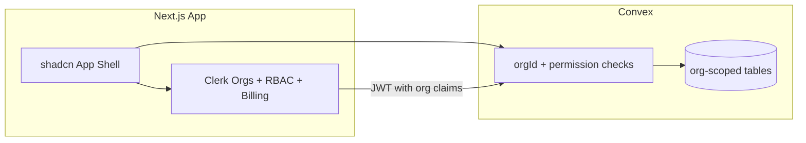

# Ledger Shark MVP — Core AR (Option A)

## Current baseline

The repo is the Convex `nextjs-clerk` starter: Clerk + Convex JWT already wired in [`components/ConvexClientProvider.tsx`](components/ConvexClientProvider.tsx) and [`convex/auth.config.ts`](convex/auth.config.ts). No orgs, billing, or accounting domain yet. Auth middleware in [`proxy.ts`](proxy.ts) only protects `/server`.

**shadcn is already initialized and themed by the user — respect it, do not re-init or overwrite.** Confirmed setup:
- [`components.json`](components.json): `style: "radix-nova"`, `baseColor: "neutral"`, `cssVariables: true`, `iconLibrary: "lucide"`, aliases include `hooks: @/hooks`, `ui: @/components/ui`
- [`app/globals.css`](app/globals.css): full custom theme via CSS variables for light + `.dark`, including `sidebar-*` and `chart-1..5` tokens, an extended `--radius-*` scale, and imports `tw-animate-css` + `shadcn/tailwind.css`
- [`lib/utils.ts`](lib/utils.ts): `cn()` helper present
- Installed so far: only [`components/ui/button.tsx`](components/ui/button.tsx)

## Product defaults (locked)

- **Scope:** Clients + Invoices (CRUD, statuses, tax) + basic dashboard + Org RBAC + Billing scaffolding
- **Out of scope for MVP:** Expenses, AI OCR, PDF, recurring invoices, public share links, multi-currency, full P&amp;L
- **Membership mode:** Required (pure B2B — every signed-in user must have an active org)
- **Roles:** Custom Clerk roles mapped from the feature spec
  - `org:owner` → manage members, billing, settings, full CRUD
  - `org:accountant` → CRUD clients/invoices (no member/billing admin)
  - `org:viewer` → read-only
- **Billing:** Organization Plans in Clerk (Free / Pro / Business) with **feature slugs** ready for gating; exact feature→plan mapping can change later without schema rewrites
- **Routing:** App shell under `/app/*` using Clerk’s **active organization** (`orgId` from session). No `/orgs/[slug]` nesting for MVP (simpler; switcher still works)

## Clerk skills to follow (use these, do not hand-roll)

Every Clerk-related step below MUST be implemented by first reading and following the matching installed Clerk skill rather than from memory:

- **`clerk-setup`** — base install is already done; use it for: `clerk doctor` health check, the Core-2 shadcn theme wiring (`@clerk/themes`), `ClerkProvider` placement/`dynamic` prop, and the middleware matcher pitfalls table.
- **`clerk-orgs`** — enabling Organizations (membership required), custom roles/permissions, `OrganizationSwitcher`, `has({ role/permission })`, `choose-organization` session task, slug/orgId invariants. Also its `references/roles-permissions.md` and `references/nextjs-patterns.md`.
- **`clerk-billing`** — enabling Billing, Organization Plans + seat caps, `<PricingTable for="organization" />`, `<OrganizationProfile />`, `has({ plan/feature })`, and `references/b2b-patterns.md` + `references/billing-webhooks.md`.
- **`clerk-webhooks`** — the webhook route: `verifyWebhook(req)` from `@clerk/nextjs/webhooks`, making the route public in `proxy.ts`, and the Clerk (not Stripe) event names.
- **`clerk-nextjs-patterns`** — middleware strategy (public-first vs protected-first), `await auth()` server vs `useAuth()` client, protecting Server Actions / API routes. On v6 use `!!userId` (no `isAuthenticated`/`sessionStatus`).
- **`clerk-custom-ui`** — applying the shadcn theme to Clerk components' `appearance` so hosted UI matches the `radix-nova` palette.

> **SDK version pin:** `@clerk/nextjs` v6 = **Core 2**. Follow every `> Core 2 ONLY` callout in the skills: themes import from `@clerk/themes` (+ `@clerk/themes/shadcn.css`), `ClerkProvider` may wrap `<html>` (but keep inside `<body>` is fine), use `<Protect>` rather than `<Show>`, and check `!!userId` instead of `isAuthenticated`.

---

## Phase 0 — Clerk Dashboard + platform wiring (manual / CLI)

Follow the **`clerk-orgs`** and **`clerk-billing`** skills for every step here (prefer the `clerk` CLI flows they document: `clerk enable orgs`, `clerk enable billing`, `clerk config patch`). Run **`clerk doctor --json`** first (per `clerk-setup`) to confirm the existing integration is healthy before adding orgs/billing:

1. **Enable Organizations** — Membership **required**; hide personal accounts
2. **Custom roles + permissions** (Dashboard → Roles & Permissions, or `clerk api` / config patch):
   - Permissions (examples): `org:clients:read|write`, `org:invoices:read|write`, `org:reports:read`, plus System Permissions for owner (`org:sys_memberships:manage`, `org:sys_billing:manage`, etc.)
   - Attach to `org:owner` / `org:accountant` / `org:viewer`
   - Set Creator role = `org:owner`, Default invite role = `org:accountant` (or viewer — pick accountant for YouTube demo flow)
3. **Enable Billing** (`clerk enable billing --for org` or Dashboard)
4. **Create Organization Plans** with seat caps matching the spec sheet:
   - Free: 1 seat, soft limits later via features
   - Pro: 5 seats
   - Business: higher/unlimited seats
5. **Attach Features** (slugs used later with `has({ feature })`): e.g. `clients_unlimited`, `invoices_unlimited`, `reports`, `recurring` (stub), `ai_receipts` (stub). Wire only soft gates that MVP needs (e.g. free: 5 clients / 10 invoices/month); leave unused features inert
6. Ensure Convex JWT template includes org claims (`org_id`, `org_role`, `org_permissions`) — verify via Clerk Convex integration page

Human steps: enable Orgs + Billing and create plans/roles in Dashboard (or Clerk CLI if linked). Dev can proceed on Free gateway without production Stripe.

---

## Phase 1 — App foundation (auth shell, shadcn, route protection)

1. **Add missing shadcn components — do NOT re-init.** shadcn is already set up (`radix-nova` style, `neutral` base, themed [`app/globals.css`](app/globals.css)); reuse the existing [`components.json`](components.json) so new components inherit the user's style/theme. Add only what's missing via `npx shadcn@latest add <name>` (keeps existing `button.tsx`): `input`, `label`, `form`, `table`, `dialog`, `sheet`, `dropdown-menu`, `select`, `badge`, `card`, `tabs`, `separator`, `sidebar`, `chart`, `skeleton`, `sonner` (toasts). Never overwrite `globals.css`, `components.json`, or existing components; if the CLI prompts to overwrite, decline. The `sidebar` and `chart` components are already theme-ready since `sidebar-*` and `chart-1..5` tokens exist.
2. **Replace demo UI** — strip numbers demo from [`app/page.tsx`](app/page.tsx); marketing/landing or redirect signed-in users to `/app`
3. **Auth routes & middleware** — expand [`proxy.ts`](proxy.ts) following **`clerk-nextjs-patterns`** (`references/middleware-strategies.md`) and the `clerk-setup` matcher pitfalls:
   - Protect `/app(.*)`
   - Public: `/`, sign-in/up, `/api/webhooks(.*)` (required by `clerk-webhooks`)
   - Require active `orgId` for `/app` (redirect to choose-org / create-org session task per `clerk-orgs` Membership required)
   - Clerk theme: install `@clerk/themes` and set `<ClerkProvider appearance={{ baseTheme: shadcn }}>` per `clerk-setup` → shadcn Theme (Core 2 variant), importing `@clerk/themes/shadcn.css`
4. **App shell** — responsive layout: sidebar (desktop) / sheet nav (mobile), `OrganizationSwitcher` (`hidePersonal`), `UserButton`, role-aware nav. Per `clerk-orgs` on Core 2, gate with `<Protect permission="...">` (not `<Show>`)
5. **Org onboarding pages** — create-org / choose-org using Clerk components (`TaskChooseOrganization` if needed), per `clerk-orgs` "Session Task — Choose Organization"
6. **Billing page** — `/app/billing` with `<PricingTable for="organization" />` + `<OrganizationProfile />` for members/billing admin UI, per `clerk-billing` `references/b2b-patterns.md`

---

## Phase 2 — Convex multi-tenant security model

> **FIRST-CLASS SECURITY REQUIREMENT — cross-org isolation.** No organization may ever read, list, count, modify, or delete another organization's data through any Convex function. This is a hard invariant, not a best-effort. Every domain function is scoped to the caller's authenticated `orgId`, and the isolation is verified by automated tests (see "Isolation test suite" below) that are part of the acceptance criteria for this phase. If the isolation guarantee cannot be met for a given function, that function does not ship.

### Org isolation invariants (non-negotiable)

1. **`orgId` is server-derived only, never client-supplied.** It comes exclusively from the verified Clerk JWT (`ctx.auth.getUserIdentity()`), never from function `args`. Any function argument named `orgId` is a bug — reject the pattern in review.
2. **No active org = no access.** If the identity has no `orgId` claim, domain functions throw `"No active organization"` before touching the database.
3. **Every domain table carries a required `orgId`** and is only queried through an `orgId`-first index (`by_org*`). List/read queries MUST use `.withIndex("by_org", q => q.eq("orgId", ctx.orgId))` — never `.filter()` and never an unscoped `.collect()`/full scan.
4. **Get-by-id is guarded by an ownership check.** `ctx.db.get(id)` can return any org's document, so every single-document fetch goes through a helper that verifies `doc.orgId === ctx.orgId` and otherwise throws a not-found error (see `getOrgDocOrThrow`). The same check runs before every `patch`/`replace`/`delete`.
5. **Relational writes are same-org validated.** When an invoice references a `clientId` (or any cross-document link), the referenced document is loaded and its `orgId` is confirmed to match the caller's org before the write proceeds — preventing an attacker from attaching their invoice to another org's client.
6. **Fail closed and don't leak existence.** Cross-org access returns the same "not found" error as a truly missing document, so callers can't probe for the existence of other orgs' records.
7. **No raw `query`/`mutation` for domain tables.** All domain access goes through the `authedOrgQuery` / `authedOrgMutation` wrappers below; using the bare Convex builders for `clients`/`invoices`/etc. is disallowed so the scoping can't be forgotten.

Per Convex auth guidelines + org isolation from the feature spec:

1. **Schema** in [`convex/schema.ts`](convex/schema.ts) (replace `numbers`) — every domain table has a **required** `orgId: v.string()` (Clerk org id) as the first-class tenant key with an `orgId`-first index:
   - `clients`: `orgId`, name, email, phone?, address?, notes?, `createdAt`, indexes `by_org`, `by_org_and_name`
   - `invoices`: `orgId`, `clientId`, number, status (`draft|sent|viewed|paid|overdue`), issue/due dates, lineItems (`description`, qty, unitPrice, taxRate), currency fixed `USD` for MVP, totals (subtotal/tax/total), timestamps; indexes `by_org`, `by_org_and_status`, `by_client`, `by_org_and_number`
   - Optional thin `organizations` cache row keyed by Clerk `orgId` (name, plan slug from webhooks) — not required for `has()` gating but useful for display/limits
   - Drop demo `numbers` table after migrating callers
2. **Auth helpers** — `convex/lib/auth.ts`:
   - `getOrgContext(ctx)` — read identity via `ctx.auth.getUserIdentity()`; require `orgId` from the Clerk JWT (`identity.orgId` / org claim — validate actual claim names against the Clerk Convex JWT template) and throw `"No active organization"` if absent. Never accept `orgId` from args.
   - `getOrgDocOrThrow(ctx, table, id)` — the mandatory single-document accessor: loads the doc, throws a not-found error if it's missing OR if `doc.orgId !== ctx.orgId`. Used for every get/patch/replace/delete on domain tables.
   - `assertSameOrg(ctx, doc)` — reusable guard for relational writes (e.g. verifying a referenced `client` belongs to the caller's org before linking an invoice).
   - `requireOrgPermission(ctx, permission)` — RBAC check on top of org scoping; for mutations also mirror role rules. Prefer permission checks over role string compares so billing feature-gating stays composable later.
3. **Custom wrappers** — `authedOrgQuery` / `authedOrgMutation` via `convex-helpers` custom functions: call `getOrgContext` and inject `{ orgId, identity }` into `ctx` so **every** domain query/mutation is org-scoped by construction. These wrappers are the only sanctioned entry points for domain tables (invariant #7). Document a lint/review rule that bare `query`/`mutation` must not import domain tables.
4. **RBAC enforcement matrix (server-side):**

| Action | owner | accountant | viewer |
|--------|-------|------------|--------|
| Read clients/invoices/dashboard | yes | yes | yes |
| Write clients/invoices | yes | yes | no |
| Mark paid / status transitions | yes | yes | no |
| Manage members / billing UI | yes | no | no |

5. **Soft usage limits (feature-aware hooks)** — in create client/invoice mutations, check entitlements:
   - Prefer Next.js `auth().has({ feature })` for UI gates
   - For Convex, either pass nothing and enforce count against Free limits in code for MVP, or sync plan features via Clerk billing webhooks into an `orgSubscriptions` table and gate in mutations (recommended for server-side trust). Plan: minimal webhook → `orgSubscriptions` (`orgId`, `planSlug`, `status`, `features[]`). Usage-limit counts MUST also be org-scoped via the `by_org` index.

6. **Isolation test suite (acceptance gate)** — add `convex-test` (Vitest) coverage in `convex/*.test.ts` that seeds two orgs (A and B) and, acting as a member of org B, asserts every one of these is rejected/empty for org A's data:
   - `list` queries return only the caller's org rows (B never sees A's clients/invoices)
   - `get`/detail by a valid org-A document id throws not-found for org B
   - `update`/`updateStatus`/`remove` on an org-A id throws not-found for org B (no write occurs)
   - creating an invoice in org B referencing an org-A `clientId` is rejected (`assertSameOrg`)
   - a call with no active org throws `"No active organization"`
   These tests are required to pass before Phase 2 is considered done and are re-run whenever a new domain table/function is added.

---

## Phase 3 — Domain APIs + UI flows

> Every Convex function below is built on `authedOrgQuery`/`authedOrgMutation` and uses `getOrgDocOrThrow` for id lookups and `assertSameOrg` for relational writes — no exceptions (Phase 2 invariants).

### Clients
- Convex: `list`, `get`, `create`, `update`, `remove` (soft-delete or hard with invoice check)
- UI: `/app/clients` table + create/edit sheet/dialog; client detail `/app/clients/[id]` with invoice history + outstanding balance (computed from non-paid invoices)

### Invoices
- Convex: CRUD + `updateStatus`; compute totals server-side from line items + tax
- Status flow for MVP: `draft → sent → paid` (+ manual `overdue` or a scheduled internal mutation later; no public “viewed” without public links)
- UI: list with filters (status), create/edit form (line items editor), detail page with status actions gated by permission

### Dashboard
- Query aggregations for active org: revenue (paid totals by month), outstanding (sum of sent/viewed/overdue), invoice counts by status
- shadcn **Chart** (Recharts) for outstanding vs collected, using the existing `--chart-1..5` theme tokens; summary cards
- Mobile: stacked cards, horizontal scroll sparingly, charts resize

### Remove starter demos
- Delete or gut [`convex/myFunctions.ts`](convex/myFunctions.ts), [`app/server`](app/server)

---

## Phase 4 — Billing scaffolding (not full monetization polish)

1. Webhook route `app/api/webhooks/clerk/route.ts` built from **`clerk-webhooks`**: `verifyWebhook(req)` from `@clerk/nextjs/webhooks`, route made public in [`proxy.ts`](proxy.ts), `CLERK_WEBHOOK_SIGNING_SECRET` env var
2. Handle org + subscription lifecycle using **Clerk event names** (`subscription.created/updated`, `subscriptionItem.*`) and the nested `payer.organization_id` payload per `clerk-billing` `references/billing-webhooks.md`; update `orgSubscriptions`
3. UI: pricing table (`<PricingTable for="organization" />`); upgrade CTAs when Free limits hit
4. Document feature slugs in one constants file (`lib/billing-features.ts`) so future gates stay consistent — even if Pro/Business features beyond limits are stubs

---

## Phase 5 — Polish for YouTube/MVP quality

- Empty states, loading skeletons, form validation (zod + react-hook-form via shadcn form)
- Invoice numbering per org (sequential or year-prefixed)
- Responsive audit (mobile nav, tables → card lists on small screens)
- Metadata/branding: Ledger Shark naming in [`app/layout.tsx`](app/layout.tsx)

---

## Key files to add/change

| Area | Files |
|------|--------|
| Clerk middleware | [`proxy.ts`](proxy.ts) |
| Providers / layout | [`app/layout.tsx`](app/layout.tsx), new `app/app/layout.tsx` |
| Schema + authz | [`convex/schema.ts`](convex/schema.ts), `convex/lib/auth.ts` (org context + `getOrgDocOrThrow` + `assertSameOrg`), `convex/lib/orgFunctions.ts` (`authedOrgQuery`/`authedOrgMutation`), `convex/clients.ts`, `convex/invoices.ts`, `convex/dashboard.ts` |
| Isolation tests | `convex/clients.test.ts`, `convex/invoices.test.ts` (`convex-test` + Vitest, two-org cross-access assertions) |
| UI | `components/ui/*` (add missing shadcn only; keep existing `button.tsx` + theme), `components/app-sidebar.tsx`, pages under `app/app/` |
| Billing | `app/app/billing/page.tsx`, `app/api/webhooks/clerk/route.ts` |

---

## Implementation order (execution sequence)

1. Add missing shadcn components (respect existing radix-nova theme) + app shell skeleton; apply Clerk shadcn theme per `clerk-setup`  
2. Clerk orgs middleware + switcher + role/permission config, following `clerk-orgs` + `clerk-nextjs-patterns` (coordinate human Dashboard/CLI steps)  
3. Convex schema + org auth helpers (`getOrgContext`, `getOrgDocOrThrow`, `assertSameOrg`, `authedOrgQuery`/`authedOrgMutation`)  
4. Cross-org isolation test harness (two-org fixtures) stood up alongside the first domain table so isolation is proven as features land  
5. Clients CRUD end-to-end (+ isolation tests)  
6. Invoices CRUD + statuses + tax totals (+ isolation tests, incl. same-org `clientId` validation)  
7. Dashboard metrics + charts (org-scoped aggregations)  
8. Billing enablement + PricingTable + webhook + Free limits  
9. Cleanup starter demo + responsive pass  

## Risk notes

- **Cross-org isolation (highest priority):** Treated as a first-class invariant (Phase 2). The main failure modes to guard against: (a) trusting a client-supplied `orgId` — never do it, always derive from the JWT; (b) `ctx.db.get(id)` returning another org's doc without an ownership check — always go through `getOrgDocOrThrow`; (c) relational writes linking across orgs — always `assertSameOrg` on referenced docs; (d) using `.filter()`/full scans instead of the `by_org` index. All four are covered by the required two-org isolation test suite.
- **JWT org claims in Convex:** Confirm claim fields after Clerk template update; adjust `getOrgContext(identity)` once against a real token. Isolation depends on this claim being present and correct, so verify it before relying on it.
- **Billing gates permissions:** When Billing is on, custom `org:<feature>:<action>` permissions require matching Features on the active Plan — attach Free features carefully so Owner isn’t locked out.
- **Clerk SDK version:** Project is on `@clerk/nextjs` v6 (Core 2). Prefer `Protect` vs `Show` where Core 2 applies; skill callouts say `Show` is Core 3 — use patterns matching installed SDK.
- **Preserve user's shadcn theme:** Do not run `shadcn init`, and never overwrite [`components.json`](components.json) or [`app/globals.css`](app/globals.css). Only `add` missing components; decline any CLI overwrite prompts. Style is `radix-nova` on `neutral` — new components should inherit it automatically.
- **Clerk component theming (concrete):** On Core 2 (`@clerk/nextjs` v6), follow `clerk-setup` → shadcn Theme (Core 2 variant): `npm install @clerk/themes`, wrap `<ClerkProvider appearance={{ baseTheme: shadcn }}>` importing `shadcn` from `@clerk/themes`, and add `@import '@clerk/themes/shadcn.css';` to [`app/globals.css`](app/globals.css) (this is the one allowed addition to globals.css — an import line, not a token change). This makes `OrganizationSwitcher`, `UserButton`, `PricingTable`, and `OrganizationProfile` match the palette. If the app adds dark mode later, pass the matching Clerk theme via `next-themes`.
